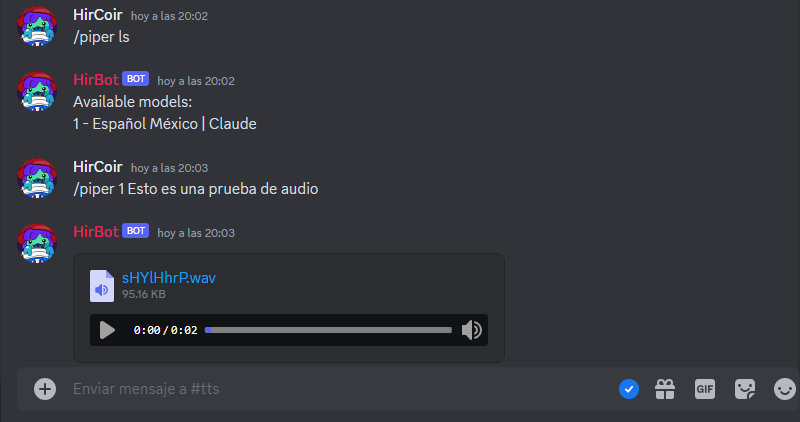

 # Bot Discord Piper


Este bot de Discord permite a los usuarios convertir texto a voz utilizando modelos previamente entrenados en formato .onnx. El bot utiliza Piper, una herramienta para la conversión de texto a voz (TTS).

## Guía de Instalación utilizando Docker

1. Clone el repositorio e introduzca sus modelos .onnx en la carpeta models:
    ```bash
    git clone https://github.com/HirCoir/PiperTTS-Discord-Bot.git
    cd PiperTTS-Discord-Bot
    ```
    

2. Construya la imagen de Docker:
    ```bash
    docker build -t piper_discord_bot .
    ```

3. Ejecute el contenedor de Docker:
    ```bash
    docker run -d --name piper_bot piper_discord_bot
    ```

Asegúrese de tener Docker instalado en su sistema antes de proceder con la instalación.

## Uso

1. Invite al bot a su servidor de Discord utilizando el enlace de invitación generado por Discord después de crear la aplicación del bot.

2. Utilice los siguientes comandos para interactuar con el bot:
    - `/piper help`: Proporciona información sobre cómo utilizar el bot.
    - `/piper list`: Muestra los modelos disponibles para la conversión de TTS.
    - `/piper [model_number] [text]`: Convierte el texto proporcionado utilizando el n�mero de modelo especificado. Reemplace `[model_number]` con el n�mero de modelo obtenido desde el comando de lista y `[text]` con el texto que quiera convertir.

## Configuración

- `BOT_TOKEN`: Reemplace este token de Discord con su bot token propio.
- `temp_audio_folder`: Establezca el path de la carpeta de audio temporaria.
- `piper_binary_path`: Establezca el path al archivo ejecutable de Piper.
- `model_folder`: Establezca el path a la carpeta que contiene los archivos .onnx de los modelos.

Asegúrese de que el contenedor de Docker tenga acceso a los recursos necesarios, como los archivos de modelo y el ejecutable de Piper.
Tenga en cuenta que debe reemplazar el marcador de posición BOT_TOKEN con su propio token de bot de Discord.
